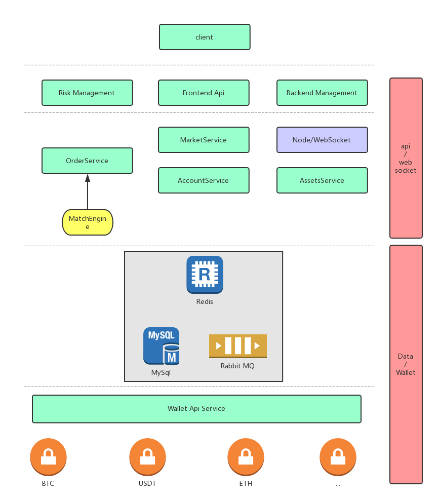
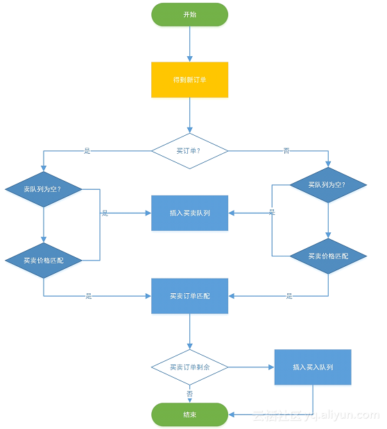

# 加密数字货币交易所

## 概述

要实现一个功能完备、运行稳定、性能可靠的加密数字货币交易所系统，需要考虑的方面极多，其所涉及的技术点也很繁复。这里我们并不是要讨论实现一个立马可以上线运行的交易所，只是阐述所需要的特殊业务要求以及其实现方案。


上图展示交易所系统必须实现业务需求的技术层次划分。我们分析上面的层次划分，大致可以把交易所系统业务分为：

### 客户端
### 行情系统
### 交易系统
### 风控管理
### 后台管理
### 钱包系统

客户端可以是浏览器访问、移动App、PC工具，这部分技术和其它行业领域也没有什么不同。风控、后天管理系统需要根据业务设计系统的风险、后台管理策略，这两块我们亦不做特殊说明。我们把重点放在行情系统、交易系统、钱包系统上面。

## 交易系统

用户在客户端发起购买、出售加密货币之后，请求需要进去买卖盘队列，系统需要根据请求的时间以及出价进行优先级队列排序，匹配符合买卖契约的请求，使订单成交，业界称之为订单撮合。这里要注意，购买、售出的数量是可以多次扣减的，即一个买单可以对应多个卖单，反之亦然。这个撮合系统的交易规则可以参见下图：

有了上面的匹配规则，我们就可以根据所需要的业务，区分不同的货币，把买、卖订单通过消息队列push到系统中进行买卖盘匹配撮合成交了。

撮合系统分为内存撮合和数据库撮合，早年间都是直接通过sql处理价格委托订单撮合，这种方式最大的问题就是并发量上不去，所以现在非常流程把数据直接放到内存中进行撮合交易。

要实现一个稳定的撮合系统亦非常不易，尤其是内存撮合，要充分考分系统的可用性，所以直接购买一套订单撮合系统集成到交易所系统里面也是很多team选择的方案。

## 行情系统

行情系统所展示的行情数据，一定程度上取决于交易系统什么时候能push出交易数据，对于实时性要求不高的数据可以后台跑job统计业务数据。

最重要的行情数据就是业务k线图，这块数据格式已经形成了业界标准规范了，可以参加开源k线图展示库：tradingview。https://www.tradingview.com/

## 钱包系统

系统和加密货币网络通信的钱包系统其实说穿了没有什么复杂，业界一般有三种方案：

1、直接调用原生客户端提供grpc的http接口；

2、通过第三方公司提供的钱包接口，如比特狗；

3、自建钱包客户端与分布式网络通讯。

市面上的交易所基本都是采用方案1、2，原因你懂。

钱包系统很值得一提的就是冷热钱包的分离，就是线上运行的钱包系统不能放太多钱进去，要把超过线上热钱包阈值的钱转出到冷钱包，冷钱包秘钥可以通过多种方案保存，甚至可以打印到纸张上。